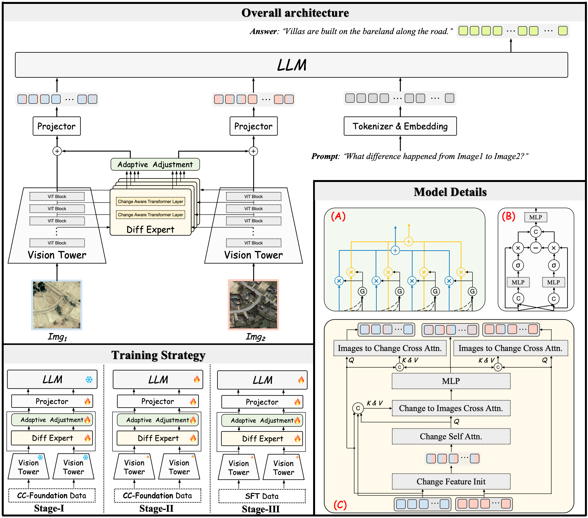
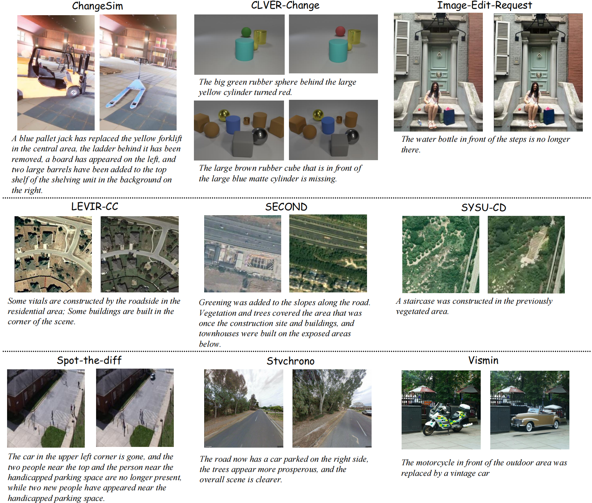

<div align="center">
    <h2>
        CCExpert: Advancing MLLM Capability in Remote Sensing Change Captioning with Difference-Aware Integration and a Foundational Dataset
    </h2>
    <p>
        Mingze Wang<sup>1†</sup>, Zhiming Wang<sup>1†</sup>, Sheng Xu<sup>1</sup>, Yanjing Li<sup>1</sup> and Baochang Zhang<sup>1*</sup><br>
        <br>
        <sup>1</sup>Beihang University<br>
        <sup>†</sup>Equal Contribution, <sup>*</sup>Corresponding Author<br>
    </p>
</div>

[](https://github.com/Meize0729/CCExpert)
[](LICENSE)
<!-- [](http://arxiv.org/abs/2403.07564) -->

<div align="center">
  
</div>


## Introduction

This repository is the code implementation of the paper [CCExpert: Advancing MLLM Capability in Remote Sensing Change Captioning with Difference-Aware Integration and a Foundational Dataset](), which is based on the [LLaVA-NeXT](https://github.com/LLaVA-VL/LLaVA-NeXT) project.

The current branch has been tested under PyTorch 2.3.0 and CUDA 12.1, supports Python 3.9+, and is compatible with most CUDA versions.

If you find this project helpful, please give us a star ⭐️, your support is our greatest motivation.

## Update Log

🌟 **2024.11.18** Release the arXiv version of the paper
🌟 **2024.11.12** Release the weight, training logs and infer results.
🌟 **2024.11.07** Release the source code and part of CC-Foundation Dataset.

## Table of Contents

- [Introduction](#Introduction)
- [Update Log](#Update-Log)
- [Table of Contents](#Table-of-Contents)
- [1.Installation](#1.-Installation)
- [2.Dataset Preparation](#2.-Dataset-Preparation)
- [3.Model Training](#3.-Model-Training)
- [4.Model Testing](#4.-Model-Testing)
- [Model Zoo](#model-zoo)
- [Common Problems](#Common-Problems)
- [Acknowledgement](#Acknowledgement)
- [Citation](#Citation)
- [License](#License)
- [Contact](#Contact)

## 1. Installation

### Dependencies

- Linux
- Python 3.9+, recommended 3.9
- PyTorch 2.3 or higher, recommended 2.3
- CUDA 12.1 or higher, recommended 12.1
- transformers 4.40.1 or higher, recommed 4.40.1

### Install CCExpert

Download or clone the CCExpert repository.

```shell
git clone git@github.com:Meize0729/CCExpert.git
cd CCExpert
```

### Environment Installation

We recommend starting to configure the environment from a Linux machine with [cuda12.1](https://developer.nvidia.com/cuda-12-1-0-download-archive) and [cudnn9.4.0](https://developer.nvidia.com/cudnn-9-4-0-download-archive). Then you need to install `openjdk-11-jdk` for evaluation metrics.

Next, you can install the relevant environment through the script we have prepared.

```shell
bash env_prepare.sh
```


## 2. Dataset Preparation

At CCExpert, we proposed a large dataset named **"CC-Foundation Dataset"** for change captioning services. 
<div align="center">
  
</div>

The first step you need to take is to download the relevant dataset in [Baidu NetDisk](https://pan.baidu.com/s/15rUtozI-cFA1u_7JsIglgw?pwd=ccmz) (The access code: ccmz). However, I am very sorry that I can only open source a very small part of the data. If you have a special need, please get in touch with me. The subsequent data will be fully open sourced after the next piece of work.

Please note that when using these datasets, please follow the licenses of respective datasets!!! Next, process the downloaded data according to the following steps.~

<details>

**Step 0**: Download CC-Foundation in [Baidu NetDisk](https://pan.baidu.com/s/15rUtozI-cFA1u_7JsIglgw?pwd=ccmz), unzip the compressed package therein.

**Step 1**: Use the `add_sbsolute_path_to_all_json.py` script included in CC-Foundation to generate a subfolder that contains all the json data files that will be used. At the same time, the image path will change from a relative path to an absolute path.

```shell
# "{CC_Foundation_Local_Absolute_Path} stores the absolute path for saving this dataset for you."
export CC_Foundation_Local_Absolute_Path=/your/local/absolute/path
python3 ${CC_Foundation_Local_Absolute_Path}/add_sbsolute_path_to_all_json.py ${CC_Foundation_Local_Absolute_Path}
```

**Step 2**: [This location](scripts/CCExpert_data_scripts)stores several yaml files, which correspond to CPT data, benchmark training set and test set template respectively. You need to use[scripts/CCExpert_data_scripts/add_CC_Foundation_local_absolute_path_to_yaml.py](scripts/CCExpert_data_scripts/add_CC_Foundation_local_absolute_path_to_yaml.py)to add the absolute path stored by CC-Foundation to these template yaml files to facilitate finding the corresponding json annotation files.

```shell
python3 ./scripts/CCExpert_data_scripts/add_CC_Foundation_local_absolute_path_to_yaml.py \
    --yaml_file="./scripts/CCExpert_data_scripts/cptdata_RSupsampled_template.yaml" \
    --base_path="${CC_Foundation_Local_Absolute_Path}"
python3 ./scripts/CCExpert_data_scripts/add_CC_Foundation_local_absolute_path_to_yaml.py \
    --yaml_file="./scripts/CCExpert_data_scripts/benchmark_LEVIR-CC_train_template.yaml" \
    --base_path="${CC_Foundation_Local_Absolute_Path}"
python3 ./scripts/CCExpert_data_scripts/add_CC_Foundation_local_absolute_path_to_yaml.py \
    --yaml_file="./scripts/CCExpert_data_scripts/benchmark_LEVIR-CC_test_template.yaml" \
    --base_path="${CC_Foundation_Local_Absolute_Path}"
```
</details>

## 3. Model Training

The entire training process involves: **Run Baseline ➡️ Run CCExpert**.

All the code supports "training while testing" and can automatically print relevant indicators in the log. At the same time, the checkpoint with the best Sm indicator can be automatically saved.

### Run Baseline

We have written the training script. As long as you follow the above steps and pay attention to the operations, you only need to open the corresponding script and adjust the `NUM_GPUS` and `WORK_DIR` you are using. We strongly recommend running the baseline first and then running CCExpert.

```shell script
# Train LLaVA_OneVision_0.5b in LEVIR-CC benchmark
bash ./scripts/CCExpert_train_scripts/LLaVA_OneVision_0.5b_LEVIR-CC_baseline.sh

# Train LLaVA_OneVision_7b in LEVIR-CC benchmark
bash ./scripts/CCExpert_train_scripts/LLaVA_OneVision_7b_LEVIR-CC_baseline.sh
```

### Run CCExpert

We believe that you have run through the baseline. Here it is a bit more complicated. We have included three stages of training in one script. Similarly, you only need to adjust the `NUM_GPUS` and `WORK_DIR` you are using.

```shell script
# Train CCExpert_0.5b CPT + SFT
bash ./scripts/CCExpert_train_scripts/CCExpert_0.5b_3stage_cpt_sft.sh

# Train CCExpert_7b CPT + SFT
bash ./scripts/CCExpert_train_scripts/CCExpert_7b_3stage_cpt_sft.sh
```

## 4. Model Testing

After you obtain the best checkpoint, you can use the following script for additional testing and inference.

```shell script
# Single-Card Eval, The script can automatically save prediction results and metric results.
python3 ./scripts/CCExpert_infer_eval_scripts/eval_CCExpert.py \
        --model_name "llava_qwen_cc" \
        --model_path "${Your Checkpoint absolute path}" \
        --out_path "${Your Checkpoint absolute path or Any path you like}" 

# Multi-Card Eval, The script can automatically save prediction results and metric results.
python3 ./scripts/CCExpert_infer_eval_scripts/eval_CCExpert.py \
        --model_name "llava_qwen_cc" \
        --model_path "${Your Checkpoint absolute path}" \
        --out_path "${Your Checkpoint absolute path or Any path you like}" \
        --DDP \
        --world_size 8

# Single-Card Infer, You need to simply modify the path of the script and so on. It is very simple.
python3 ./scripts/CCExpert_infer_eval_scripts/infer_CCExpert.py
```

## Model Zoo
| Model | BLEU-4 | METEOR | ROUGE<sub>L</sub> | CIDEr-D | S<sub>m</sub><sup>*</sup> | Weight | Log | Infer Results |
| :---: | :---: | :---: |  :---: | :---: | :---: | :---: | :---: | :---: |
**CCExpert-0.5b** | 65.42 | 41.33 | 75.93 | 141.19 | 80.99 | [Baidu Disk](https://pan.baidu.com/s/1XUTWog9mToXqNAYk5knQOQ?pwd=cc05) | [80.99](https://raw.githubusercontent.com/Meize0729/storage/refs/heads/main/CCExpert/CCExpert_0.5b_3stage_train.log) | -
**CCExpert-7b** | 65.49 | 41.82 | 76.55 | 143.32 | 81.80 | [Baidu Disk](https://pan.baidu.com/s/1jLfZ8pirXM_JqRNRo9TGSA?pwd=cc70) | [81.80](https://raw.githubusercontent.com/Meize0729/storage/refs/heads/main/CCExpert/CCExpert_7b_3stage_train.log) | [url](https://raw.githubusercontent.com/Meize0729/storage/refs/heads/main/CCExpert/CCExpert_7b_LEVIR-CC_infer_results.txt)


## Common Problems

<details>
</details>

## Acknowledgement

This project is developed based on the [LLaVA-NeXT](https://github.com/LLaVA-VL/LLaVA-NeXT). Thanks to the developers of these projects.

## Citation

If you use the data, code, performance benchmarks and pre-trained weights of this project in your research, please refer to the bibtex below to cite CCExpert.

```
~
```

## License

This project is licensed under the [Apache 2.0 license](LICENSE).

## Contact

If you have any other questions❓, please contact wmz20000729@buaa.edu.cn in time 👬.

I apologize, the code we provide has not been thoroughly optimized. We will continue to refine it.

We will certainly do our utmost to assist you, and your inquiries will also contribute significantly to the optimization of this project.


